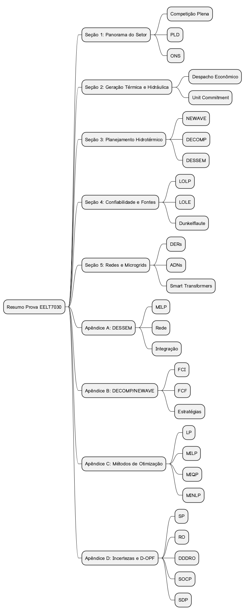

# TOPICS IN POWER SYSTEM GENERATION AND EXPANSION PLANNING

## OBJECTIVES

The purpose of this summary is to provide a **comprehensive and structured review material** for the course **EELT7030 – Planning of Power System Operation and Expansion**.

This document organizes **60 essential study topics**, distributed across six main sections that cover the fundamental pillars of the discipline:

1. Overview and Structure of the Electric Power Sector  
2. Thermal and Hydraulic Generation  
3. Hydrothermal Planning and Optimization  
4. Reliability and Emerging Energy Sources  
5. Distribution Networks, Microgrids, and Uncertainties  
6. Power System Expansion Planning  

In addition, the compendium includes **five detailed appendices**, which delve into specific methods, tools, and models:

- **Appendix A:** Technical Summary of DESSEM  
- **Appendix B:** Strategies of DECOMP and NEWAVE  
- **Appendix C:** EPE’s MDI Model  
- **Appendix D:** Optimization Methods (LP, MILP, QP, MIQP, NLP, MINLP)  
- **Appendix E:** Uncertainties and D-OPF Formulations  

Thus, this summary offers a **unified and complementary view** of the theoretical and practical aspects necessary for a solid understanding of the subject and for good performance in essay-based evaluations.  
Happy studying!

---

## CHEATSHEET – CONTENT ORGANOGRAM

*Figure 1 – Quick Reference to the Summary Sections*

## OVERVIEW AND STRUCTURE OF THE ELECTRIC POWER SECTOR

### FULL COMPETITION
Full competition in the electric power sector refers to a market model in which all consumers—regardless of size—are free to choose their electricity suppliers. In this scenario, the exclusivity of service by the local distribution company is eliminated, allowing direct negotiations between consumers and generators or energy traders. This arrangement aims to increase the sector’s economic efficiency, foster competition, and reduce costs for the end user. However, such competition also requires **strong regulatory oversight** to ensure fair access to transmission and distribution networks, preventing discriminatory practices. In practical terms, full competition is an important step toward modernizing the market and aligning the sector with international best practices.

### SPOT MARKET AND SETTLEMENT PRICE (PLD)
The **short-term market**, or **spot market**, is the environment where the settlement of differences between contracted and effectively consumed or generated energy takes place. This market is priced by the **Settlement Price for Differences (PLD)**, calculated weekly based on optimization models that reflect the system’s operating conditions. The PLD seeks to indicate the **marginal cost of system operation**, considering both hydrological conditions and thermal plant availability. As such, it provides economic signals that influence consumption, contracting, and investment decisions. The PLD is therefore a **central mechanism** in the operation of the Brazilian electricity market, affecting both free and captive market participants.

### FUNCTIONS OF THE NATIONAL SYSTEM OPERATOR (ONS)
The **National System Operator (ONS)** performs three essential functions: **technical coordination**, **security**, and **economic optimization**.  
- *Technical coordination* involves real-time control of generation and transmission, ensuring balance between supply and demand.  
- *System security* seeks to reduce the risk of rationing or blackouts through reliability criteria and preventive planning.  
- *Economic optimization* aims to dispatch energy resources in a way that minimizes total costs—both present and future—while respecting physical and environmental constraints.  
Thus, ONS is a **key institution** ensuring both the reliability and the economic efficiency of the interconnected Brazilian power system.

### RENEWABLE ENERGY VS. CLEAN ENERGY
Although often used interchangeably, **renewable energy** and **clean energy** are not identical concepts.  
- *Renewable energy* refers to sources that naturally regenerate on human timescales, such as solar, wind, biomass, and hydropower.  
- *Clean energy*, on the other hand, refers to the **environmental impact** of the source, being characterized by very low or zero emissions of pollutants and greenhouse gases.  

Consequently, a source may be renewable without being entirely clean—for example, **biomass**, which, despite being renewable, can emit pollutants. Conversely, **nuclear energy** is not renewable, but it can be considered clean from the perspective of direct emissions.

### ENERGY TRANSITION
**Energy transition** is the process of transforming the energy matrix by reducing the share of fossil fuels in favor of renewable and low-impact sources. This transformation arises from the need to mitigate **climate change**, lowering greenhouse gas emissions and promoting long-term sustainability. Moreover, energy transition encompasses **technological innovation**, **new consumption models**, and **profound socio-economic shifts**. It is directly linked to the concept of **sustainable development**, as it aims to meet current energy needs without compromising the welfare of future generations. In the electric power sector, this transition is expressed through the growing integration of **wind, solar, biomass, and green hydrogen** resources.
## THERMAL AND HYDRAULIC GENERATION

### ENERGY TRANSITION
The **energy transition** is the process of transforming the energy matrix by reducing the participation of fossil fuels in favor of renewable and low-impact sources. This transformation arises from the need to mitigate the effects of **climate change**, lowering greenhouse gas emissions and promoting greater sustainability. In addition, it involves **technological innovation**, **new consumption models**, and **deep socioeconomic changes**. The concept is directly linked to **sustainable development**, aiming to meet current energy demands without compromising the welfare of future generations. In the electric sector, the transition is characterized by the growing integration of **wind, solar, biomass, and green hydrogen** technologies.

### ADVANTAGES OF THERMAL POWER PLANTS
Thermal power plants offer several operational advantages. One of the main benefits is the possibility of being located near load centers, reducing transmission losses and improving system reliability. They also have relatively short construction times, allowing a faster response to demand growth. Another key aspect is their independence from hydrological conditions, making them crucial during drought periods. Furthermore, thermal plants provide **operational flexibility**, complementing renewable generation when its availability is low. These factors justify their strategic importance, despite their higher environmental and economic costs.

### DISADVANTAGES OF THERMAL POWER PLANTS
Despite their strategic role, thermal power plants have notable drawbacks. Environmentally, they contribute to **air pollution**, **greenhouse gas emissions**, and, in the case of nuclear plants, **radioactive waste** that is difficult to manage. From a cost perspective, they tend to be more expensive to operate compared to low marginal-cost renewable sources. Other disadvantages include the **thermal pollution** of nearby water bodies due to cooling systems and **social and environmental impacts** related to biomass land use. Therefore, while indispensable in power systems, their use must be balanced with cleaner and more sustainable alternatives.

### ECONOMIC DISPATCH
The **economic dispatch problem** determines the optimal generation allocation among available units to meet demand at the lowest possible cost. It is a continuous optimization problem considering the variable production costs of each plant and their operational limits. Unlike Unit Commitment, it does not decide whether a unit should be turned on or off — only how much each online unit should generate. This method is widely used in daily system operations because it minimizes costs while respecting power limits. Although relatively simple, it forms the basis for more complex models such as **Unit Commitment (UC)**.

### UNIT COMMITMENT
The **Unit Commitment (UC)** problem extends the economic dispatch by deciding **which generating units should be turned on or off** at each time period, in addition to determining their production levels. It introduces **binary (integer) variables**, representing the discrete nature of on/off decisions. The model includes additional constraints such as minimum up/down times, ramping limits, and hot/cold startup costs. Due to its complexity, UC is typically solved using **advanced mathematical programming techniques**. It is an essential tool for **short-term operation planning**, ensuring cost-effective and reliable generation scheduling.

### LAGRANGE MULTIPLIERS
In the context of power system operation, **Lagrange multipliers** have an important **economic interpretation**. They represent the **shadow price** of a constraint — that is, the rate at which the total cost would change if the constraint were relaxed by one unit. For example, if the generation limit of a thermal unit increased by 1 MW, the multiplier indicates how much the minimum cost would decrease. When associated with demand balance constraints, they represent the **marginal operating cost** of the system. Therefore, Lagrange multipliers are crucial for understanding **price formation** and guiding **planning and investment decisions**.

### RESERVOIRS
Hydropower plants can be classified as **run-of-river**, which have negligible storage capacity, or **reservoir plants**, which store significant amounts of water. The latter provide **flexibility** by allowing water storage during wet periods for use during dry seasons, acting as **natural energy batteries** that ensure supply reliability. In computational models, reservoir representation varies with planning horizon — more aggregated in the medium term and more detailed in the short term. Efficient reservoir management is thus a **central element** of hydrothermal operation.

### WATER BALANCE EQUATION
The **water balance equation** is the fundamental relationship governing the operation of a hydropower plant with a reservoir. It relates the final storage volume to the initial volume, plus inflows, minus the outflows due to **turbining and spillage**. Mathematically, it expresses the **conservation of mass** in the hydrological system. This balance is critical in both short- and long-term studies, as it predicts future generation availability and ensures that operation complies with physical reservoir limits. It also links **present water use** with its **future value**, forming the basis of hydrothermal optimization models.

### CASCADING HYDRO PLANTS
Hydropower plants arranged in **cascades** are hydraulically coupled since the **discharge from an upstream plant becomes the inflow** of the downstream one. This interdependence adds significant complexity to system operation, requiring models that capture these interactions. Coordinated management of cascaded reservoirs allows maximizing global energy generation while avoiding water spillage. It is also necessary to account for **water travel times** between plants, introducing temporal delays in the hydraulic balance. Consequently, the planning of cascaded hydropower systems must be approached **integratively and systematically**.

### HYDROPOWER PRODUCTION FUNCTION
The **hydropower production function** establishes the relationship between **turbined flow** and **generated power**. It depends on the **net head height** and the **turbine-generator efficiency**. In simplified form, power can be approximated as the product of flow and plant productivity. However, in reality, this function is **nonlinear**, since the net head varies with reservoir level and hydraulic losses. Understanding this function is essential for **optimizing water use**, maximizing generation efficiency, and ensuring economic dispatch within tariff constraints.

### HYDRAULIC LOSSES
**Hydraulic losses** occur during water flow through penstocks and other hydraulic structures of a plant. They are typically modeled as **quadratic or cubic functions** of the turbined flow. As flow increases, losses grow, reducing the **available net head** for generation. These losses must be considered in operation models since they directly affect the effective power output. Ignoring them leads to **overestimation of generation potential**. Accurate modeling of hydraulic losses thus contributes to more realistic simulations of hydropower performance.

### TURBINE-GENERATOR EFFICIENCY
The **turbine-generator efficiency** is a key determinant of hydropower plant performance, representing the proportion of hydraulic energy converted into useful electrical energy. In practice, efficiency is **non-constant**, varying nonlinearly with both **turbined flow** and **available head**. Efficiency curves typically feature a **peak region** of optimal operation and zones of reduced performance. Operating close to the optimal range enhances generation efficiency and reduces costs. Planning and optimization models frequently include these efficiency curves for a more accurate physical representation of plant behavior.

### PROHIBITED OPERATING ZONES
Some hydropower plants have **prohibited operating zones** due to mechanical, hydraulic, or environmental constraints. These correspond to power or flow ranges that should be avoided to prevent **vibrations, cavitation**, or **negative ecological impacts**. Operational dispatch must respect these restrictions to ensure equipment safety and longevity. In mathematical models, such zones are represented as **non-feasible intervals** within the generation domain. Compliance with these constraints is therefore both a **technical and environmental requirement** in hydropower operation.

### SPILLAGE
**Spillage** occurs when a portion of the reservoir inflow cannot be used for generation and must be released through spillways. This typically happens during high inflow periods when **turbine capacity limits** are reached or **hydraulic restrictions** must be met. While necessary for plant safety, spillage represents a **loss of potential energy**. Planning models seek to minimize spillage by maximizing the utilization of turbined water. In some cases, however, controlled spillage is **mandated for environmental reasons**, such as maintaining minimum downstream flow.

### TEMPORAL COUPLING
**Temporal coupling** is a key characteristic of reservoirs: the decision to release water in one period directly affects future storage availability. This means operational decisions must be **intertemporal**, not isolated by stage. In optimization models, this coupling is captured through the **reservoir volume as a state variable**. It justifies the use of techniques such as **dynamic programming**, which handle sequential dependencies. Correctly modeling temporal coupling ensures more efficient and sustainable water use throughout the planning horizon.

### SPATIAL COUPLING
**Spatial coupling** arises in systems with multiple hydraulically connected reservoirs, such as cascaded plants. In such systems, the operation of one reservoir affects not only its own storage but also downstream conditions. This interdependence increases the complexity of the optimization problem since interactions between multiple reservoirs must be considered simultaneously. In practical terms, upstream releases can **increase or decrease downstream generation capacity**, depending on cascade topology. Therefore, **integrated hydro system planning** is essential to maximize economic and energetic benefits.

## HYDROTHERMAL PLANNING AND OPTIMIZATION

### MAIN OBJECTIVE OF HYDROTHERMAL PLANNING
The main goal of **hydrothermal system operation planning** is to minimize the total operating cost of the power system while ensuring reliable demand supply. This process considers the **physical constraints** of generating units—such as generation limits and hydraulic balance—as well as **electrical network constraints**. It must also comply with **environmental and regulatory requirements**, including minimum flow levels and emission limits. The **objective function** incorporates both thermal generation costs and energy deficit penalties. Thus, hydrothermal planning seeks to balance **economic efficiency**, **energy security**, and **environmental sustainability**.

### MEDIUM-TERM PLANNING (NEWAVE)
The **NEWAVE model** is used for **medium-term planning**, representing the hydroelectric park through **Equivalent Energy Reservoirs (REEs)**. This aggregation simplifies the problem by grouping plants within hydrologically equivalent regions, reducing computational complexity. The adopted solution method is **Stochastic Dual Dynamic Programming (SDDP)**, which handles inflow uncertainty probabilistically. NEWAVE produces **Marginal Operating Cost (CMO)** series, which act as price signals for market agents. Despite its simplifications, NEWAVE provides a consistent foundation for defining long-term operational strategies across multiple years.

### SHORT-TERM PLANNING (DECOMP)
The **DECOMP model** is employed for **short-term planning**, with a horizon of weeks to months. Unlike NEWAVE, it represents **individual hydro plants**, allowing for a more detailed description of operational constraints. Its solution method is **Deterministic Dual Dynamic Programming (DDDP)**, in which inflows are represented through fixed scenarios rather than stochastic processes. DECOMP enables the evaluation of **detailed operation strategies**, accounting for hydraulic losses, efficiencies, and network constraints. It serves as the **main operational planning tool** used by the **National System Operator (ONS)** to guide mid-term dispatch decisions.

### VERY SHORT-TERM PLANNING (DESSEM)
The **DESSEM model** operates on a **very short-term horizon**, ranging from hours to days, with **hourly time resolution**. It explicitly represents the **electrical network** using DC power flow or, in more advanced versions, full AC formulations. DESSEM integrates multiple generation types—hydroelectric, thermal, wind, solar—and **storage systems**, in a unified framework. Its formulation is typically a **Mixed-Integer Linear Programming (MILP)** problem due to the presence of discrete variables (e.g., unit commitment decisions). DESSEM is used for **daily energy dispatch**, providing high-precision scheduling that supports **real-time operation** of the national grid.

### MARGINAL OPERATING COST (CMO)
The **Marginal Operating Cost (CMO)** represents the **incremental cost of meeting an additional 1 MW of demand**. It corresponds to the **Lagrange multiplier** associated with the power balance constraint in the optimization problem. The CMO reflects the **economic value of stored water**, since current reservoir use directly impacts future thermal generation costs. Moreover, it functions as a **price signal** in the short-term electricity market, influencing both generation and consumption decisions. In summary, the CMO is a **central indicator** of system efficiency and economic equilibrium in the electric sector.

### FUTURE COST (CF)
The **future cost** quantifies the economic value of water storage for future periods, embodying the **intertemporal nature** of hydro operation. It is estimated using methods such as **Dynamic Programming** or **Benders Decomposition**, which approximate the multi-stage cost function. The future cost acts as a **proxy for the benefit of conserving water**, discouraging excessive generation in the present. Consequently, it guides the **optimal turbining policy** at each stage. Proper representation of future cost ensures **balance between short-term and long-term operation**, promoting sustainable system management.

### IMMEDIATE COST (CI)
The **immediate cost** refers to the **actual operating cost** incurred in a specific stage, considering thermal dispatch, spillage, deficits, and imports. It is computed based on the generation decisions made within that period, without accounting for future effects. This concept complements the **future cost**, as together they form the **expected total cost**. Minimizing only the immediate cost may lead to **myopic decisions**, such as inefficient reservoir depletion. Therefore, optimal planning requires balancing both **immediate and future costs** to achieve efficient intertemporal operation.

### BELLMAN’S PRINCIPLE OF OPTIMALITY
**Bellman’s Principle of Optimality** states that an optimal policy possesses the property that, regardless of the initial state or decision, subsequent decisions must form an optimal policy for the resulting state. This principle underpins **Dynamic Programming**, enabling the decomposition of a global optimization problem into smaller, sequential subproblems. In energy planning, it governs the decision-making process for **turbining and water storage** in each stage, ensuring intertemporal consistency. Bellman’s principle is therefore a **fundamental theoretical foundation** for hydrothermal system modeling.

### CURSE OF DIMENSIONALITY
The **curse of dimensionality** arises when the number of state and decision variables in an optimization problem grows exponentially with the number of reservoirs, time steps, or discretization granularity. This phenomenon is a major limitation of **Dynamic Programming**, where detailed reservoir representation leads to intractable problem sizes. To mitigate this issue, **aggregation**, **approximation**, and **decomposition techniques** are employed. A common example is the use of **Equivalent Energy Reservoirs (REEs)** in the NEWAVE model. Thus, the curse of dimensionality remains one of the **greatest computational challenges** in hydrothermal planning.

### FUTURE COST FUNCTION USING BENDERS CUTS
**Benders cuts** are a **decomposition technique** used to approximate the future cost function in multi-stage problems. The method solves the problem iteratively, adding **linear cuts** at each iteration to refine the approximation of the cost-to-go function. This approach significantly reduces computational complexity, making large-scale optimization feasible. In the context of hydrothermal planning, **Benders cuts approximate the future value of stored water**, ensuring intertemporal consistency between stages. As a result, they enable robust and efficient operation planning under **hydrological uncertainty**.
## RELIABILITY AND EMERGING ENERGY SOURCES

### ADEQUACY
**Adequacy** is one of the key pillars of power system reliability. It refers to the system’s structural capacity to meet demand under normal operating conditions. Adequacy depends on having sufficient **installed generation, transmission, and distribution capacity** to supply projected loads. In planning, it involves ensuring **reserve margins** that guarantee service even under load growth scenarios. This assessment relies on **historical consumption data**, **future projections**, and **resource availability**. Therefore, adequacy measures the **long-term structural robustness** of the power system.

### SECURITY
**Security** is the second pillar of reliability and relates to the system’s ability to withstand unexpected disturbances such as **transmission line outages, generator failures, or extreme weather events**. It is evaluated using criteria such as the **N-1 rule**, which requires the system to remain stable after the loss of any single component. Security encompasses **transient and voltage stability** as well as **protection coordination**. In summary, while adequacy ensures sufficient resources, security ensures **resilience and operational continuity** in the face of disruptions.

### TRADITIONAL RELIABILITY INDICATORS
Traditional reliability indicators quantify the expected performance of the power system under uncertainty. The most commonly used include:  
- **LOLP (Loss of Load Probability):** probability that demand will not be met;  
- **LOLE (Loss of Load Expectation):** expected number of hours of load curtailment within a period;  
- **EENS (Expected Energy Not Supplied):** expected value of unserved energy.  

These indices provide a **quantitative foundation** for planning and operational decisions and are widely used in **generation expansion studies** and the definition of **long-term energy security criteria**.

### NEW RELIABILITY INDICATORS WITH RENEWABLES
With the increasing share of **variable renewable energy sources**, new reliability metrics have been developed to capture their specific characteristics. Examples include:  
- **ESEC (Expected Solar Energy Curtailment):** measures solar energy that could not be utilized;  
- **EWES (Expected Wind Energy Spillage):** analogous metric for wind generation losses.  

These indices allow a more realistic assessment of renewable integration challenges by accounting for both **technical curtailments** and **oversupply scenarios**. Thus, they complement classical indicators and provide more appropriate metrics for **renewable-dominated systems**.

### DUNKELFLAUTE
The German term **_Dunkelflaute_**, meaning “dark lull,” describes **extended periods with little to no wind or sunlight**. This phenomenon poses a critical challenge for systems with high shares of intermittent renewables, as it may threaten supply reliability. During such periods, **backup resources**—such as thermal plants, hydropower, or **energy storage systems**—are essential. Dunkelflaute highlights the importance of **energy diversification** and **technological integration**. Planning for this phenomenon is crucial for countries pursuing **deep decarbonization** of their power sectors.

### BIOENERGY
**Bioenergy** is produced from **biological resources** such as ethanol, biodiesel, biogas, and biomethane. It is considered **renewable**, as its feedstocks can be replenished over time. Beyond electricity generation, bioenergy plays an important role in **transportation** and **industrial processes**. However, its classification as “clean energy” is relative, since combustion may release pollutants. One of its main advantages is **dispatchability**—the ability to be stored and used on demand, unlike intermittent sources such as wind or solar. Thus, bioenergy remains a key component in **energy diversification strategies**.

### LOW-CARBON HYDROGEN
**Low-carbon hydrogen**—often referred to as **green hydrogen** when produced using renewable electricity—is one of the most promising energy carriers for future power systems. It can be generated through **water electrolysis** powered by renewable sources, avoiding carbon emissions in the process. Hydrogen offers significant potential as an **energy vector**, suitable for **transport, industry, and power generation**. Its flexibility also makes it ideal for **long-term energy storage**, helping to address renewable intermittency. Despite its promise, hydrogen still faces challenges related to **costs** and **infrastructure** for production and transport.

### ENERGY STORAGE SYSTEMS (ESS)
**Energy Storage Systems (ESS)** are essential components of modern power systems, enabling **energy shifting** from periods of surplus to periods of scarcity. Technologies include **batteries**, **pumped hydro storage**, and **hydrogen-based systems**. ESS provide services such as **frequency regulation**, **renewable smoothing**, and **enhanced reliability**. From a planning perspective, they reduce operating costs by limiting the dispatch of high-cost thermal units. Additionally, storage systems play a key role in **smart grid development** and the integration of **electric vehicles** into the power network.

### ELECTRIC VEHICLES (EVs)
**Electric Vehicles (EVs)** represent both a new type of load and an opportunity for grid flexibility. When widely adopted, they can significantly **increase power demand**, especially during peak hours. However, with **smart and bidirectional charging technologies**, EVs can function as **distributed storage systems**. The **Vehicle-to-Grid (V2G)** concept allows EVs to return energy to the grid when needed, contributing to **system stability, flexibility, and renewable integration**. Proper modeling of EV penetration is therefore crucial for **future operation and planning studies**.

### CARBON CAPTURE, UTILIZATION, AND STORAGE (CCUS)
**Carbon Capture, Utilization, and Storage (CCUS)** technologies aim to reduce emissions from fossil-fueled power plants, mitigating their environmental impacts. The process involves **capturing CO₂ emissions**, transporting them, and **storing them in geological formations** or using them in **industrial applications**. This approach allows continued operation of thermal plants while supporting **decarbonization goals**. Although costly and infrastructure-intensive, CCUS is considered a **strategic transitional technology**, bridging the gap between the current fossil-based energy system and a **renewable, low-carbon future**.
## DISTRIBUTION NETWORKS, MICROGRIDS, AND UNCERTAINTIES

### DISTRIBUTION NETWORK ASSETS
The **distribution network** comprises various assets that ensure the reliable delivery of electricity to end users. Among the most important are **feeders**, which carry power from substations to load centers, and **power transformers**, which adjust voltage levels for transmission and distribution. Other critical components include **voltage regulators**, **capacitor banks**, and **protection devices** such as circuit breakers and reclosers. Proper coordination of these assets is essential to maintain **power quality** and **supply continuity**. Accurate modeling of these elements is fundamental for **distribution system planning and operation studies**.

### ACTIVE DISTRIBUTION NETWORKS (ADNs)
**Active Distribution Networks (ADNs)** represent the evolution of traditional distribution grids into **active and intelligent networks**. In these systems, **distributed generation**, **energy storage systems**, and **demand response resources** interact in a coordinated manner. Active management allows the network not only to consume power but also to **supply it back to the grid** when needed. This enhances **flexibility**, improves **reliability**, and reduces **losses**. ADNs are therefore a cornerstone of the **energy transition**, enabling greater integration of renewables and advanced services. Their planning requires **sophisticated optimization and control techniques**.

### MICROGRIDS (MGs)
**Microgrids** are small-scale power systems that integrate **distributed generation**, **energy storage**, and **controllable loads** under centralized or local coordination. They can operate either **connected to the main grid** or in **islanded mode**, providing autonomy during outages. This concept increases **energy resilience**, allowing critical loads to remain supplied during network disturbances. Additionally, microgrids promote the use of **local energy resources** such as solar and biomass. From a planning perspective, they introduce new coordination challenges but also offer **innovative solutions** for efficient distributed resource integration.

### DEMAND RESPONSE (DR)
**Demand Response (DR)** enables consumers to **reduce or shift their electricity usage** in response to price signals or financial incentives. It helps balance the system during **peak demand periods** or **generation shortages**. Beyond improving reliability, DR lowers operational costs by avoiding the dispatch of expensive peaking plants. There are two main types of DR programs: **price-based** and **incentive-based**. In operational planning, DR should be modeled as a **dispatchable resource**, capable of providing **flexibility comparable to generation units**.

### SMART TRANSFORMERS (ST)
**Smart Transformers (STs)** are advanced electronic devices that function as **energy routers** within hybrid **AC/DC microgrids**. In addition to traditional voltage transformation, they incorporate power converters capable of **independent control of active and reactive power**. This enables **bidirectional power flow management** and enhances **voltage quality**. STs also facilitate the integration of **renewables and storage systems**, reducing the need for auxiliary equipment. In operational planning, they represent a **technological breakthrough**, expanding control capabilities in **complex and interactive grids**.

### CHALLENGES OF DISTRIBUTED ENERGY RESOURCES (DERs)
The integration of **Distributed Energy Resources (DERs)**—such as solar PV and wind—poses significant challenges for distribution networks. One is **reverse power flow**, which can stress equipment designed for unidirectional operation. Another is **voltage regulation**, affected by renewable intermittency. Higher DER penetration may also increase **losses** and **dispatch complexity**. These issues demand **new control, planning, and investment strategies**. Hence, DERs bring both **benefits and challenges** to grid modernization efforts.

### CURTAILMENT
**Curtailment** refers to the **intentional reduction of renewable generation** when production exceeds demand or when technical constraints prevent full utilization. Although it results in the loss of clean energy, curtailment may be necessary to **maintain system stability** and **adhere to safety limits**. With growing renewable penetration, curtailment is becoming increasingly frequent. In planning models, it can be represented as a **decision variable** with zero generation cost but constrained by the grid’s absorption capacity. Thus, curtailment reflects a **trade-off between efficiency and operational security**.

### HIERARCHICAL OPTIMIZATION IN ADNs
The operation of **Active Distribution Networks** can be structured under a **hierarchical optimization framework**. In this configuration, a **master level** coordinates global decisions such as power flows and resource dispatch, while **local levels (slaves)** optimize the performance of individual microgrids or subsystems. This approach reduces computational complexity by **distributing decision-making** across scales. It also enhances **data privacy** and **local autonomy**. In planning applications, hierarchical optimization is viewed as a **promising solution** for managing systems with numerous distributed resources.

### ROBUSTNESS AGAINST UNCERTAINTIES
Operational planning must contend with uncertainties in **renewable availability**, **demand variability**, and **equipment failures**. Purely deterministic methods are often inadequate for such conditions. Consequently, **stochastic**, **robust**, and **data-driven optimization techniques** are employed. **Robust optimization** seeks secure solutions under worst-case scenarios, whereas **data-driven methods** leverage historical information to build realistic uncertainty sets. These approaches minimize the risk of inefficient or insecure operations. Therefore, **robustness to uncertainty** is a key requirement in modern **energy planning models**.

### THE THREE Ds OF ENERGY
The so-called **Three Ds of Energy**—**Decarbonization**, **Digitalization**, and **Decentralization**—represent the major trends shaping the 21st-century power sector.  
- **Decarbonization** aims to cut greenhouse gas emissions through renewable expansion and energy efficiency.  
- **Digitalization** integrates communication and control technologies, enabling **smart grids** and greater consumer participation.  
- **Decentralization** emphasizes **distributed generation**, **microgrids**, and **local autonomy**.  

In some contexts, a **fourth D—Democratization**—is added, referring to consumer empowerment in energy markets. Together, these principles define the **future trajectory of global power systems**.
## GENERATION AND TRANSMISSION EXPANSION

### CONCEPT AND PURPOSE
The **Investment Decision Model (MDI)** is a **Mixed-Integer Linear Programming (MILP)** formulation developed by the **Energy Research Office (EPE)** to determine the optimal **generation and transmission expansion plan** for the Brazilian **National Interconnected System (SIN)**. Its main goal is to minimize the **expected total cost of expansion**—comprising investment and operating costs—over a ten-year planning horizon, while accounting for uncertainties related to **hydrological and wind conditions**. The MDI ensures an **efficient and economically sustainable expansion** of the generation fleet, maintaining supply security and adequacy to meet projected demand.

### STRUCTURE OF THE MDI
The MDI is implemented in the **Pyomo modeling environment** and solved using the **CPLEX** solver, employing a **graph-based representation** of interconnected subsystems. Each subsystem is defined by its **average energy demand** and **peak load**, while generation plants—existing, contracted, or candidate—are explicitly modeled. The framework also represents **interconnections between subsystems** and their **transmission exchange capacities**. The formulation incorporates **stochastic uncertainty treatment**, enabling the optimal expansion plan to be derived by **minimizing the expected cost**, weighted by the probability of hydrological and wind scenarios.

### DEMAND REPRESENTATION
System demand is modeled using **four load segments**—light, medium, heavy, and peak—each associated with a specific duration and intensity. This segmentation preserves **monthly average energy** while capturing the temporal variability of consumption. Modeling multiple load levels allows for performance assessment of different generation technologies across **daily and seasonal variations**, while capacity constraints ensure that **available power** satisfies **instantaneous peak demand plus reserve requirements**. This guarantees both **energy and capacity adequacy** throughout the planning horizon.

### MODELED GENERATION SOURCES
The MDI represents all major generation technologies in detail.  
- **Hydropower plants** are modeled using energy and power series derived from the **SUISHI** and **NEWAVE** hydrothermal models.  
- **Thermal plants** are characterized by their **Variable Operation Cost (CVU)**, **inflexibility levels**, and **load-level dispatch**.  
- **Non-dispatchable renewable sources** (wind, solar, and small hydro) are represented through **average contribution factors** and **seasonal generation profiles**.  
- **Energy storage technologies**, including **batteries** and **pumped-storage plants**, can be incorporated to transfer energy between load levels, accounting for **losses and associated costs**.

### OBJECTIVE FUNCTION
The objective of the MDI is to **minimize the expected total expansion cost**, encompassing **investment**, **operation**, and **penalty costs**, while optionally including a **perpetuity term**. This perpetuity component ensures that investment decisions made near the end of the planning horizon are properly valued, avoiding the so-called *“end-of-horizon problem.”* The function sums **discounted costs** using a defined rate, thereby representing the **present value** of all investment and operation decisions. The resulting plan defines the **economically optimal expansion strategy**, balancing cost minimization with system reliability.

### MAIN CONSTRAINTS
The MDI includes several constraint categories to ensure **technical and operational feasibility**:
- **Energy balance constraints** ensure that the sum of generation, exchanges, and deficits—minus stored energy—is sufficient to meet demand in each load level and subsystem.  
- **Capacity constraints** guarantee that peak demand is covered with an adequate **operational reserve margin**.  
- **Resource availability constraints** prevent decommissioning of existing units.  
- **Transmission constraints** limit energy exchanges between subsystems based on interconnection capacities.  
- **Investment and regulatory constraints** govern the **pace, timing, and proportion** of expansion in line with national energy policy.  

Together, these constraints ensure that the expansion plan is **technically viable** and **consistent with real-world regulatory and operational conditions**.

### UNCERTAINTY TREATMENT
The MDI addresses **hydrological and wind uncertainties** through the generation of multiple **scenarios**, each associated with a **probability of occurrence**. These scenarios are organized in a **decision tree structure**, where investment decisions must remain robust across future conditions. The model applies the **deterministic equivalent approach**, converting the stochastic problem into a single optimization problem by **weighting expected costs** according to scenario probabilities. This ensures that the proposed expansion is **resilient** and **cost-effective** under diverse natural resource conditions.

### DECISION VARIABLES
The MDI’s decision variables describe the **system state and decisions** at each time step, including:
- **Investment decisions** ($x_{i,t}$)  
- **Generation per load level and period** ($G_{i,p,t}$)  
- **Installed capacity** ($C_{i,t}$)  
- **Inter-subsystem energy and power exchanges** ($I_{ij,p,t}$)  
- **Energy and capacity deficits** ($D_{p,t}$)  
- **Stored energy** ($B_{a,p,t}$)  

Together, these variables allow the model to **jointly optimize** investment, dispatch, and exchange decisions, subject to technical and economic constraints. Their **mixed (continuous and binary)** nature makes the problem computationally challenging but ensures **realism and accuracy** in system representation.

### MODEL OUTPUTS
The outputs of the MDI provide a comprehensive view of the **optimal expansion plan** for the power system. Key results include:
- **Commissioning schedule** for new plants;  
- **Marginal expansion and operation costs (CME and CMO)**;  
- **Inter-regional power flows**;  
- **System reliability indicators**.  

Additionally, the model identifies **transmission bottlenecks** and quantifies the **contribution of each generation source** to load supply. These results serve as technical input for the **Ten-Year Energy Expansion Plan (PDE)**, guiding **public policy** and **investment decisions** based on consistent techno-economic criteria.

### RELATIONSHIP WITH THE MARGINAL EXPANSION COST (CME)
The **Marginal Expansion Cost (CME)** is directly derived from the MDI through the **dual multipliers** associated with energy and capacity constraints. It represents the **incremental cost of meeting an additional unit of demand**, simultaneously reflecting the need for **energy expansion** and **peak capacity**. The CME is calculated by introducing a **1 MW increase in demand** for each load level and observing the resulting impact on total expansion cost.  

In the **PDE 2030** horizon, the **average CME** was estimated at **R$ 187.46/MWh**, with energy and capacity components of **R$ 105.65/MWh** and **R$ 688.18/kW/year**, respectively. This metric provides a unified reference for assessing **economic efficiency** and **investment adequacy** in Brazil’s long-term power sector planning.
## TECHNICAL APPENDIX: SUMMARY OF THE DESSEM MANUAL

### PURPOSE OF DESSEM
**DESSEM** is the computational model used for **very short-term operation planning**, with a horizon of up to seven days and **hourly discretization**. Its main objective is to determine the **optimal dispatch** of hydro, thermal, and complementary resources while minimizing the total system cost. The model explicitly represents the **electrical network**, ensuring operational security and feasibility. As such, DESSEM provides the **initial conditions for real-time operation** and supports the **centralized dispatch** performed by the **National System Operator (ONS)**.

### MATHEMATICAL FORMULATION
The mathematical formulation of DESSEM is based on **Mixed-Integer Linear Programming (MILP)**, incorporating both continuous and binary variables.  
- **Continuous variables** represent **generation levels** and **network power flows**.  
- **Binary variables** represent **Unit Commitment** decisions, such as switching thermal units on or off.  

This formulation allows a realistic representation of operational constraints but also increases computational complexity. Consequently, DESSEM employs **decomposition techniques** and **high-performance algorithms** to ensure convergence within practical computational times.

### HYDRAULIC REPRESENTATION
The **hydraulic subsystem** in DESSEM models the **hourly operation of hydroelectric plants**, accounting for reservoir volumes, inflows, turbine discharges, spillage, and minimum downstream releases. **Water balance constraints** ensure mass conservation at each stage. The model also incorporates **plant-specific productivity coefficients**, **hydraulic losses**, and **turbine flow limits**. This detailed representation ensures that **hydraulic energy is optimally utilized** in compliance with environmental and physical restrictions.

### THERMAL REPRESENTATION
Thermal generation units are modeled considering their **variable operating costs**, **minimum and maximum generation limits**, **startup and shutdown costs**, and **ramping constraints**. The inclusion of **Unit Commitment logic** ensures temporal consistency by enforcing **minimum up and down times**. This level of detail captures the actual operational characteristics of thermal plants, allowing the model to determine **both the generation output and the on/off status** of each unit at every hour.

### ELECTRICAL NETWORK REPRESENTATION
DESSEM uses a **DC power flow (linearized)** formulation to represent **transmission constraints** and approximate **network losses**. Each bus in the network is subject to **active power balance equations**, and transmission lines and transformers are modeled with **capacity limits**. Contingencies and **inter-regional exchange limits** can also be included. This network representation ensures that dispatch results are not only **economically optimal** but also **electrically feasible**, integrating both the **energy** and **network perspectives** of system operation.

### MODULAR STRUCTURE OF THE MODEL
DESSEM is organized into **modular components**, each responsible for a specific aspect of the problem:  
- **Hydraulics** – reservoir operation and water balance;  
- **Thermal** – generation and commitment;  
- **Network** – transmission constraints;  
- **Operational reserves** – system security margins.  

These modules are combined within a **main optimization framework**, enabling **parallel computation** and efficient scalability. This modular design improves **maintainability, flexibility, and computational performance**, making DESSEM suitable for large-scale systems such as the **Brazilian SIN**.

### INTEGRATION WITH OTHER MODELS
DESSEM operates in conjunction with other models in the planning chain.  
- It receives **initial conditions**—such as reservoir volumes and operating policies—from the **medium-term models DECOMP and NEWAVE**.  
- DESSEM refines these results with **hourly precision**, bridging the gap between medium-term planning and **real-time operation**.  
- Its outputs then serve as inputs for the **ONS’s real-time dispatch**.  

This integration ensures **coherence across planning horizons**, avoiding inconsistencies between **short-, medium-, and long-term** decision processes.

### PRACTICAL APPLICATIONS
In practice, DESSEM is used to:  
- Determine the **hourly Marginal Operating Cost (CMO)**;  
- Identify the **optimal dispatch** of each generation resource;  
- Evaluate **inter-regional energy exchanges**;  
- Set **short-term market prices**;  
- Conduct **electrical security analyses**, such as transmission limits and load shedding assessments.  

The model is particularly critical in systems with **high shares of variable renewable generation**, as it can integrate **hourly wind and solar forecasts**. In doing so, DESSEM provides a **robust decision-support framework** for operation planning in increasingly complex and dynamic energy environments.
### Mathematical Modeling of DESSEM

#### Hydropower Plants

##### Sets and Indices
- $\mathcal{T} = \{1,\dots,T\}$ – hourly periods
- $\mathcal{H} = \{\text{UHE}_1, \dots, \text{UHE}_{n_h}\}$ – hydropower plants
- $\mathcal{U}(h) \subseteq \mathcal{H}$ – set of upstream hydropower plants of $h$

##### Parameters (Data)
- $a_{h,t}$ – natural inflow to plant $h$ in period $t$ (m$^3$/s)
- $d_t$ – demand in period $t$ (MWh/h) 
- $\zeta_{\text{vol}}$ – volume–flow conversion factor (hm$^3$/h) $\Rightarrow \frac{3600}{10^6}$
- $\zeta$ – hydraulic constant $\Rightarrow \frac{9.81}{1000}$ (MW per m$^3$/sm of head)
- $V_{{\min}_h},\,V_{{\max}_h}$ – volume limits (hm$^3$)
- $Q_{{\min}_h},\,Q_{{\max}_h}$ – turbined flow limits (m$^3$/s)
- $V_{{\text{ini}}_h}$ – initial reservoir volume (hm$^3$)
- $V_{{\text{meta}}_h}$  – target terminal volume (hm$^3$)
- $C_{{\text{def}}}$ – unitary cost of deficit (\$/MWh)
- $\alpha_{h,k},\,\beta_{h,k},\,\gamma_{h,k}$ – polynomial coefficients for $h_{\text{up}}$, $h_{\text{down}}$, $h_{\text{loss}}$
- $\rho_{h,k}$ – polynomial coefficients of the specific productivity $\rho_h$

##### Decision Variables

- $Q_{h,t} \ge 0$ – turbined flow (m$^3$/s)
- $S_{h,t} \ge 0$ – spillage (m$^3$/s)
- $V_{h,t} \ge 0$ – stored volume (hm$^3$)
- $G_{h,t} \ge 0$ – hydropower generation (MWh/h)
- $D_t \ge 0$ – energy deficit (MWh/h)

##### Hydraulic Polynomial Functions for Plant $h$

- $\rho(Q, H_{\text{net}}) = \zeta \,\Big( \rho_0 + \rho_1 Q + \rho_2 H_{\text{net}} + \rho_3 Q H_{\text{net}} + \rho_4 Q^2 + \rho_5 H_{\text{net}}^2
\Big), \text{ (CEPEL, 2023)}$ 
- $h_{\text{up},h}(V) = \sum_{k=0}^{K_a} \alpha_{h,k}\, V^k, $
- $h_{\text{down},h}(q) = \sum_{k=0}^{K_b} \beta_{h,k}\, q^k,$ 
- $h_{\text{loss},h}(Q) = \sum_{k=0}^{K_\gamma} \gamma_{h,k}\, Q^k.$

##### Hydropower Production Function (HPF)
- $H_{{\text{net}}_{h,t}} = h_{\text{up},h}(V_{h,t})- h_{\text{down},h}(Q_{h,t}+S_{h,t}) - h_{\text{loss},h}(Q_{h,t}),$
- $G_{h,t} = \zeta \, Q_{h,t}\, \rho_h(Q_{h,t}, H_{{\text{net}}_{h,t}})\, H_{{\text{net}}_{h,t}} \quad \textbf{(Exact HPF)},$
- $G_{h,t} = \zeta \mathrm{PE} H_{{\mathrm{net}}_{h,t}} Q_{h,t} \quad \textbf{(HPF with constant PE)},$
- $G_{h,t} = \mathrm{P}  Q_{h,t} \quad \textbf{(Linearized HPF)}.$

##### Total Instantaneous Inflow (Cascade without Delay)
$$
I_{h,t} = a_{h,t} + \sum_{u \in \mathcal{U}(h)} ( Q_{u,t} + S_{u,t} ), 
\quad \forall h\in\mathcal{H},\; \forall t\in\mathcal{T}.
$$

##### Constraints

###### Generation
$$
G_{h,t} = HPF(Q,V,S), \quad \forall h\in\mathcal{H},\, t\in\mathcal{T}.
$$

###### Reservoir Mass Balance
- $V_{h,1} = V_{{\text{ini}}_h} + \zeta_{\text{vol}} ( I_{h,1} - Q_{h,1} - S_{h,1}),$
- $V_{h,t} = V_{h,t-1} + \zeta_{\text{vol}} ( I_{h,t} - Q_{h,t} - S_{h,t}),
\quad \forall t=2,\dots,T.$

###### Targets and Operational Limits

- $V_{h,T} \ge V_{{\text{meta}}_h},$
- $V_{{\min}_h} \le V_{h,t} \le V_{{\max}_h},$
- $Q_{{\min}_h} \le Q_{h,t} \le Q_{{\max}_h},$
- $S_{h,t},\, G_{h,t},\, D_t \ge 0.$

---

#### Thermal Power Plants

##### Sets and Indices

- $\mathcal{T} = \{1,\dots,T\}, \quad$
- $\mathcal{G} = \{\text{UTE}_1,\dots,\text{UTE}_{n_g}\}.$

##### Parameters
- $d_t$ – system demand (MW)
- $P_{{\min}_g},\, P_{{\max}_g}$ – generation limits of plant $g$ (MW) (CEPEL, 2023)
- $a_g,\, b_g,\, c_g$ – thermal cost coefficients of plant $g$ 
- $SC_g$ – startup cost of plant $g$
- $R U_g,\, R D_g$ – ramp-up/ramp-down rates (MW per interval)
- $t_{{\uparrow}_g},\, t_{{\downarrow}_g}$ – minimum up/down times (h)
- $C_{\text{def}}$ – deficit penalty cost (R\$/MWh) 
- $u_{g,0},\, p_{g,0}$ – initial on/off status and generation (from initial status data)

##### Decision Variables

- $p_{g,t}\ge 0,\quad$
- $u_{g,t}, y_{g,t}, w_{g,t}\in\{0,1\},\quad$
- $D_t\ge 0.$

(where $u$ = on, $y$ = startup, $w$ = shutdown.)

##### Constraints

###### Power Balance
$$
\sum_{g\in\mathcal{G}} p_{g,t} + D_t = d_t, \quad \forall t.
$$

###### Conditional Capacity
$$
P_{{\min}_g} u_{g,t} \le p_{g,t} \le P_{{\max}_g} u_{g,t}.
$$

###### Startup/Shutdown Logic
$$
u_{g,t} - u_{g,t-1} = y_{g,t} - w_{g,t}.
$$

###### Ramping Limits
- $p_{g,t} - p_{g,t-1} \le RU_g + P_{{\max}_g} y_{g,t}$
- $p_{g,t-1} - p_{g,t} \le RD_g + P_{{\max}_g} w_{g,t}$

###### Minimum Up/Down Time

- $\sum_{\tau=t-t^{\uparrow}_g+1}^{t} y_{g,\tau} \le u_{g,t},$
- $\sum_{\tau=t-t^{\downarrow}_g+1}^{t} w_{g,\tau} \le 1-u_{g,t}.$

###### Consistent Initial Conditions
$$
p_{g,0}\in
\begin{cases}
[\,P_{{\min}_g},\,P_{{\max}_g}\,], & \text{if } u_{g,0}=1,\\
\{0\}, & \text{if } u_{g,0}=0.
\end{cases}
$$

---

#### Renewable Energies and Storage

##### Sets and Indices

- $\mathcal{T} = \{1,\dots,T\},\quad$
- $\mathcal{R} = \{1,\dots,R_{n_r}\},\quad$
- $\mathcal{S} = \{1,\dots,S_{n_s}\}.$

##### Parameters

- $\overline{g}_{r,t}$ – exogenous renewable availability profile (MW avg) 
- $\Delta t$ – time step (typically 1 h) 
- $E_{{\min}_s},\,E_{{\max}_s}$ – energy storage limits (MWh) 
- $E_{{\mathrm{ini}}_s}$ – initial energy (MWh) 
- $\overline{P}_{{\mathrm{ch}}_{s}},\,\overline{P}_{{\mathrm{dis}}_{s}}$ – max charge/discharge power (MW)
- $\eta_{{\mathrm{c}}_{s}},\,\eta_{{\mathrm{d}}_{s}}$ – charge and discharge efficiencies

##### Decision Variables

- $g_{{\mathrm{ren}}_{r,t}} \ge 0$ – dispatched renewable generation (MW)
- $E_{s,t} \ge 0$ – stored energy (MWh)
- $P_{{\mathrm{ch}}_{s,t}},\,P_{{\mathrm{dis}}_{s,t}} \ge 0$ – charging/discharging power (MW)

##### Constraints

###### Renewable Generation — Availability Limit
$$
0 \le g_{{\mathrm{ren}}_{r,t}} \le \overline{g}_{r,t}, \quad \forall r,t.
$$

###### Storage — Energy Balance (SoC)
$$
E_{s,1} = E_{{\mathrm{ini}}_s} + \eta_{{\mathrm{c}}_{s}} P_{{\mathrm{ch}}_{s,1}} \Delta t - \frac{1}{\eta_{{\mathrm{d}}_{s}}} P_{{\mathrm{dis}}_{s,1}} \Delta t,\\
E_{s,t} = E_{s,t-1} + \eta_{{\mathrm{c}}_{s}} P_{{\mathrm{ch}}_{s,t}} \Delta t - \frac{1}{\eta_{{\mathrm{d}}_{s}}} P_{{\mathrm{dis}}_{s,t}} \Delta t, \quad \forall t=2,\dots,T.
$$
###### Storage — State of Charge (SoC) Limits
$$
E_{{\min}_s} \le E_{s,t} \le E_{{\max}_s}.
$$

###### Storage — Power Limits
$$
0 \le P_{{\mathrm{ch}}_{s,t}} \le \overline{P}_{{\mathrm{ch}}_{s}},\\
0 \le P_{{\mathrm{dis}}_{s,t}} \le \overline{P}_{{\mathrm{dis}}_{s}}.
$$

---

#### Objective Function

The hydrothermal dispatch problem is formulated as a minimization of total generation and deficit costs, including:
- Thermal generation costs;
- Deficit costs (represented by a thermal deficit unit with fixed cost, as per Unsihuay, 2023);
- Penalty for reservoir spillage.

$$
\begin{aligned}
\min Z =\; &\sum_{g\in\mathcal{G}}\sum_{t\in\mathcal{T}} c_g\,p_{g,t} \\
&+ 0.3\sum_{h\in\mathcal{H}}\sum_{t\in\mathcal{T}} S_{h,t} \\
&+ C_{def}\sum_{t\in\mathcal{T}} D_t
\end{aligned}
$$

---

#### Power Balance (Load Supply)

$$
\sum_{h \in \mathcal{H}} G_{h,t} +
\sum_{g \in \mathcal{G}} p_{g,t} +
\sum_{r \in \mathcal{R}} g_{{\mathrm{ren}}_{r,t}} +
\sum_{s \in \mathcal{S}} ( P_{{\mathrm{dis}}_{s,t}} - P_{{\mathrm{ch}}_{s,t}} ) +
D_t = d_t, \quad \forall t \in \mathcal{T}.
$$

## TECHNICAL APPENDIX: SUMMARY OF THE DECOMP MANUAL

### STRATEGIC PLANNING
The **strategic planning of hydrothermal power system operation** involves defining generation targets for hydro and thermal plants over a **multi-year horizon**, while respecting electrical and operational constraints and seeking to **minimize total operating costs**. The complexity of this problem stems from two main factors:  
- **Temporal coupling**, since current decisions affect future costs due to hydrological uncertainty;  
- **Spatial coupling**, arising from interdependent operation of cascade reservoirs.  

This leads to the **decision-maker’s dilemma**: intensive use of water today may cause high thermal costs in future dry periods, whereas excessive thermal dispatch may lead to spillage and wasted energy during wet periods.

The formulation of the problem considers **Immediate Cost (FCI)** and **Future Cost (FCF)** functions, whose sum defines the **Total Cost Function (FCT)**. The derivative of the FCF with respect to stored volume defines the **value of water**, i.e., the marginal cost of using water stored in reservoirs. The balance between the marginal thermal generation cost and the value of water determines the **optimal dispatch policy**.

Given the scale of the **Brazilian National Interconnected System (SIN)** and the hydrological uncertainty, the planning process is decomposed into multiple time horizons:  
- **Medium term (NEWAVE)**: up to five years, with **energy-equivalent reservoirs**;  
- **Short term (DECOMP)**: two months, with **individual plant representation**;  
- **Very short term (DESSEM)**: hourly or sub-hourly, covering up to two weeks.  

This hierarchical modeling chain, developed by **CEPEL**, ensures consistency across planning horizons.

### IMMEDIATE, FUTURE, AND TOTAL COST FUNCTIONS IN STRATEGIC PLANNING

#### Immediate Cost Function (FCI)
The **FCI** represents the cost arising from decisions at the current stage.  
- If demand is met by hydropower, the cost is nearly zero.  
- If thermal plants are dispatched, the FCI reflects **fuel costs**.  
- If demand is unmet, the **deficit cost** (penalty) is included.

Formally, for a stage \( t \):
$$
\text{FCI}_t = C_T \cdot g_t + C_D \cdot DEF_t
$$
where \( C_T \) is the thermal generation cost, \( g_t \) the thermal generation, \( C_D \) the deficit cost, and \( DEF_t \) the unserved energy.

#### Future Cost Function (FCF)
The **FCF** represents the expected cost of current decisions on future stages. When reservoirs are low, future costs rise due to increased thermal dispatch; when full, future costs drop.  
The **Bellman equation** expresses this recursive relationship:
$$
\alpha_t(v_{t-1}) = \min \Big\{ C_T \cdot g_t + C_D \cdot def_t + \alpha_{t+1}(v_t) \Big\}
$$
subject to water balance and demand constraints.  
The slope of the FCF defines the **value of water**, representing the **marginal opportunity cost** of stored energy.

#### Total Cost Function (FCT)
The total cost is:
$$
\text{FCT} = \text{FCI} + \text{FCF}
$$
The optimal policy satisfies:
$$
\frac{\partial \text{FCI}}{\partial V} = - \frac{\partial \text{FCF}}{\partial V}
$$
ensuring equilibrium between immediate and future costs — the **marginal water value** equals the **marginal thermal cost**.

#### Application
The joint use of FCI, FCF, and FCT enables robust **multi-period water management**. These functions form the conceptual foundation of **NEWAVE, DECOMP, and DESSEM**, where the **FCF** links successive planning horizons.

### MARGINAL OPERATING COST (CMO)

The **Marginal Operating Cost (CMO)** quantifies the **incremental cost** of supplying one additional megawatt-hour.  
It reflects the **marginal opportunity cost of water** or the **benefit of retaining water** for future use.

#### Definition
According to **DESSEM’s methodology**, the CMO is determined in two steps:
1. **Marginal Cost per Bus (CMB):** obtained from the dual multipliers of bus power balance constraints.
2. **Submarket CMO:** the weighted average of bus CMOs, with weights based on bus demand.

#### Relationship with Cost Functions
- **FCI:** immediate thermal and deficit costs → CMO equals current marginal thermal cost.  
- **FCF:** captures future water value → implicit marginal hydro cost.  
- **FCT:** derivative equals total system CMO, balancing present and future costs.

Thus, CMO reflects the **optimal equilibrium** between water usage and conservation.

#### Role in Planning
The **CMO** guides hydrothermal dispatch, market price formation (short-term PLD), and ensures **inter-horizon consistency** across NEWAVE, DECOMP, and DESSEM.

### ADVANCED CONCEPTS IN STRATEGIC OPERATION PLANNING

#### Risk Aversion
Traditional planning minimizes **expected cost**, assuming **risk neutrality**. To address hydrological uncertainty, **risk-averse measures** such as **Value-at-Risk (VaR)** and **Conditional Value-at-Risk (CVaR)** are introduced, penalizing extreme deficit scenarios and promoting **more secure operational policies**.

#### Spatial Coupling
Spatial coupling arises from hydraulic interdependence among cascade plants and inter-area energy exchanges. It makes the **FCF multidimensional**, as it depends on multiple reservoir volumes simultaneously, greatly increasing model complexity.

#### Curse of Dimensionality and Decomposition
Classical Dynamic Programming (DP) suffers from exponential state-space growth. The **Stochastic Dual Dynamic Programming (SDDP)** approach mitigates this through **Benders decomposition**, approximating the FCF with **piecewise-linear cuts**, enabling multi-year tractable planning.

#### Integration with Price Formation
The **CMO**, derived from optimization duals, is the foundation for Brazil’s **Short-Term Settlement Price (PLD)**. Thus, planning results not only guide dispatch but also **transmit economic signals**, ensuring efficient and stable market operation.

### SOLUTION STRATEGIES FOR STRATEGIC OPERATION PLANNING

The **Strategic Operation Planning Problem** of the SIN is complex, involving hydrological uncertainty, coupling effects, and multiple decision layers. The main approaches include:
- **Linear Programming (LP)**  
- **Dynamic Programming (DP)**  
- **Dual and Stochastic Extensions (PDD, PDDE)**  
- **Decomposition-based methods** (as in CEPEL’s models).

#### Multistage Linear Programming (LP)
Represents the entire planning horizon as a single linear model, with hydraulic and operational constraints. Provides global optimality but is computationally intractable for large systems.

#### Deterministic Dynamic Programming (PDD)
Solves the problem recursively via **Bellman’s principle**, assuming known inflows. Pedagogically useful but limited by dimensionality.

#### Deterministic Dual Dynamic Programming (PDDD)
Approximates the FCF via **Benders cuts**, iteratively refined through forward and backward passes until convergence. Foundation of **DECOMP**.

#### Stochastic Dual Dynamic Programming (PDDE)
Extends the dual formulation to stochastic inflows (NEWAVE model), evaluating **expected future costs** under probability distributions.

#### Very Short-Term Deterministic Formulations
Used in **DESSEM**, which employs a **Mixed-Integer Linear Program (MILP)** to represent hourly hydrothermal dispatch and network constraints, coupled with DECOMP via the **Future Cost Function**.

### COMPARATIVE OVERVIEW OF STRATEGIES

| **Aspect** | **Multistage LP** | **PDD / PDDD** | **PDDE (NEWAVE)** | **DESSEM** |
|-------------|------------------|----------------|-------------------|-------------|
| **Typical Horizon** | Medium/short (small systems) | Medium (deterministic) | Long-term (stochastic) | Very short-term (hourly) |
| **Uncertainty Handling** | None | Deterministic | Stochastic scenarios | Deterministic |
| **Future Cost (FCF)** | Implicit | Approximated via Benders cuts | Stochastic Benders cuts | Coupled via DECOMP |
| **Coupling** | Temporal & spatial (explicit) | Temporal via recursion | Temporal & spatial (aggregated) | Temporal & spatial (detailed) |
| **Advantages** | Exact global optimum | Conceptually clear; didactic | Treats uncertainty efficiently | High temporal resolution |
| **Limitations** | Infeasible for large systems | Suffers from dimensionality | May yield conservative policies | Deterministic only |
| **Practical Use** | Academic | Basis of DECOMP | Basis of NEWAVE | Basis of DESSEM |

These methods form a **hierarchical chain**:  
- **NEWAVE (PDDE)** defines mid-term water value policies,  
- **DECOMP (PDDD)** refines monthly dispatch and inter-area exchanges,  
- **DESSEM (MILP)** determines hourly operation and market pricing.  

Together, they ensure **temporal and economic consistency** across Brazil’s entire energy planning framework.

### Mathematical Modeling of DECOMP

#### Hydropower Plants

##### Sets and Indices
- $\mathcal{T} = \{1,\dots,T\}$ – periods
- $\mathcal{H} = \{\text{UHE}_1, \dots, \text{UHE}_{n_h}\}$ – hydropower plants
- $\mathcal{U}(h) \subseteq \mathcal{H}$ – set of upstream hydropower plants of $h$

##### Parameters (Data)

- $a_{h,t}$ – natural inflow to plant $h$ in period $t$ (hm$^3$)
- $d_t$ – demand in period $t$ (MWh)
- $V_{{\min}_h},\,V_{{\max}_h}$ – storage limits (hm$^3$)
- $Q_{{\min}_h},\,Q_{{\max}_h}$ – turbined flow limits (hm$^3$)
- $V_{{\text{ini}}_h}$ – initial reservoir volume (hm$^3$)
- $V_{{\text{meta}}_h}$ – target terminal volume (hm$^3$)
- $C_{{\text{def}}}$ – unitary cost of deficit (\$/MWh) 

##### Decision Variables

- $Q_{h,t} \ge 0$ – turbined flow (hm$^3$)
- $S_{h,t} \ge 0$ – spillage (m$^3$)
- $V_{h,t} \ge 0$ – stored volume (hm$^3$)
- $G_{h,t} \ge 0$ – hydropower generation (MWmed)
- $D_t \ge 0$ – energy deficit (MWh/h)

##### Hydropower Production Function (HPF)
$$
G_{h,t} = P\, Q_{h,t} \quad \textbf{(Linearized HPF)}
$$

##### Constraints

###### Total Instantaneous Inflow (Cascade without Delay)
$$
I_{h,t} = a_{h,t} + \sum_{u \in \mathcal{U}(h)} ( Q_{u,t} + S_{u,t} ), \quad \forall h \in \mathcal{H}, \; \forall t \in \mathcal{T}
$$

###### Reservoir Mass Balance
$$
V_{h,1} = V_{\text{ini}_h} + ( I_{h,1} - Q_{h,1} - S_{h,1} ), \quad \forall h, \; t = 1\\
V_{h,t} = V_{h,t-1} + ( I_{h,t} - Q_{h,t} - S_{h,t} ), \quad \forall h, \; t = 2,\dots,T
$$

---

#### Thermal Units

##### Sets and Indices
$$
    \mathcal{T} = \{1,\dots,T\}, \quad\\
    \mathcal{G} = \{\text{UTE}_1,\dots,\text{UTE}_{n}\}.
$$
##### Parameters
$$
G_{\min_g}, G_{\max_g} \text{ — generation limits of unit } g \text{ (MW)}\\
c_g \text{ — thermal generation cost of unit } g
$$

##### Decision Variables
$$
p_{g,t} \ge 0 \text{ (MW)}
$$

##### Constraints

###### Capacity
$$
G_{\min_g} \le p_{g,t} \le G_{\max_g}, \quad \forall g, t
$$

---

#### Renewable Energies and Storage

##### Sets and Indices

- $\mathcal{T} = \{1,2,\dots,T\} \quad$ — periods
- $\mathcal{R} = \{1,2,\dots,N_R\} \quad$ — set of renewable units (wind/solar)
- $\mathcal{S} = \{1,2,\dots,N_S\} \quad$ — set of storage units (batteries)

##### Parameters
For each $t \in \mathcal{T}$, $r \in \mathcal{R}$, and $s \in \mathcal{S}$:

- $\overline{g}_{r,t} \text{ — exogenous renewable availability profile (MWmed)}$
- $\Delta t \text{ — time step (T), typically } \Delta t = 1$
- $E_{\min_s}, E_{\max_s} \text{ — min/max stored energy limits (MWh)}$
- $E_{\text{ini}_s} \text{ — initial energy (MWh)}$
- $\overline{P}_{\text{ch}_s}, \overline{P}_{\text{dis}_s} \text{ — maximum charge/discharge power (MW)}$
- $\eta_{\text{c}_s}, \eta_{\text{d}_s} \in (0,1] – \text{ — charging and discharging efficiencies}$

##### Decision Variables
- $g_{\text{ren}_{r,t}} \ge 0 \text{ — dispatched renewable generation of unit } r \text{ at } t \text{ (MWavg)}$
- $E_{s,t} \ge 0 \text{ — stored energy (SoC) of battery } s \text{ at } t \text{ (MWh)}$
- $P_{\text{ch}_{s,t}}, P_{\text{dis}_{s,t}} \ge 0 \text{ — charge/discharge powers (MW)}$

##### Constraints

###### Renewable Sources — Availability Limit
$$
0 \le g_{\text{ren}_{r,t}} \le \overline{g}_{r,t}, \quad \forall r \in \mathcal{R}, \; \forall t \in \mathcal{T}
$$

###### Storage — Energy Balance (SoC)
$$
E_{s,1} = – E_{\text{ini}_s} + \eta_{\text{c}_s} P_{\text{ch}_{s,1}} \Delta t - \frac{1}{\eta_{\text{d}_s}} P_{\text{dis}_{s,1}} \Delta t, \quad \forall s \in \mathcal{S}\\
E_{s,t} = – E_{s,t-1} + \eta_{\text{c}_s} P_{\text{ch}_{s,t}} \Delta t - \frac{1}{\eta_{\text{d}_s}} P_{\text{dis}_{s,t}} \Delta t, \quad \forall s \in \mathcal{S}, \; t=2,\dots,T
$$
###### Storage — State of Charge (SoC) Limits
$$
E_{\min_s} \le E_{s,t} \le E_{\max_s}, \quad \forall s \in \mathcal{S}, \; \forall t \in \mathcal{T}
$$

###### Storage — Power Limits

$$
0 \le P_{\text{ch}_{s,t}} \le \overline{P}_{\text{ch}_s}, – \quad \forall s \in \mathcal{S}, \; \forall t \in \mathcal{T}\\
0 \le P_{\text{dis}_{s,t}} \le \overline{P}_{\text{dis}_s}, \quad \forall s \in \mathcal{S}, \; \forall t \in \mathcal{T}
$$

---

#### Objective Function

The hydrothermal dispatch problem is formulated as the minimization of total generation and deficit costs, namely:

- Thermal generation costs  
- Deficit cost (represented by a thermal unit with fixed cost, as in Unsihuay, 2023)  
- Spillage penalty (energy waste)  
- For the PDDD case, the future cost term $\alpha$ (FCF) is included  

##### Single LP Objective Function
$$
\min Z = \sum_{g\in\mathcal{G}} \sum_{t\in\mathcal{T}} (c_g p_{g,t}) + 0.3 \sum_{h\in\mathcal{H}} \sum_{t\in\mathcal{T}} S_{h,t} + C_{\text{def}} \sum_{t\in\mathcal{T}} D_t
$$

##### Objective Function for PDDD
$$
\min Z = \sum_{g\in\mathcal{G}} \sum_{t\in\mathcal{T}} (c_g p_{g,t}) + 0.3 \sum_{h\in\mathcal{H}} \sum_{t\in\mathcal{T}} S_{h,t} + C_{\text{def}} \sum_{t\in\mathcal{T}} D_t + \sum_{t\in\mathcal{T}} \alpha_{k_t}
$$

---

#### Power Balance (Load Requirement)

The load balance constraint requires that the total generation from all available sources, plus battery discharge and any incurred deficit, exactly meets the system demand:

$$
\sum_{h \in \mathcal{H}} G_{h,t} + \sum_{g \in \mathcal{G}} p_{g,t} + \sum_{r \in \mathcal{R}} g_{\text{ren}_{r,t}} + \sum_{s \in \mathcal{S}} ( P_{\text{dis}_{s,t}} - P_{\text{ch}_{s,t}} ) + D_t = d_t, \quad \forall t \in \mathcal{T}
$$

## TECHNICAL APPENDIX: SUMMARY OF EPE MANUALS ON THE MDI

### CENTRAL CONCEPT
The **Investment Decision Model (MDI)** is the analytical tool developed by the **Energy Research Office (EPE)** to determine the **optimal expansion plan** for Brazil’s electricity generation system, as used in the **Ten-Year Energy Expansion Plan (PDE 2030)**.

The model minimizes the **expected total cost of expansion**, given by:

$$
C_{\text{total}} = C_{\text{investment}} + C_{\text{operation}}
$$

It is formulated as a **Mixed-Integer Linear Programming (MILP)** problem, implemented in **Pyomo** and solved using **CPLEX**.

---

### MODEL STRUCTURE

#### Demand Representation
Electricity demand is segmented into **load levels**—light, medium, heavy, and peak—each with its own duration and intensity. The total energy across levels equals the monthly average demand:

$$
\sum_{p} \tau_p D_p = D_{\text{average}}
$$

This representation allows a more accurate assessment of how generation technologies meet the system’s load profile.

#### System Components
The MDI explicitly models:
- Existing, planned, and candidate generation units;  
- Interconnections between subsystems (represented as a capacitated graph);  
- Operational reserves and capacity constraints.

#### Objective Function
The objective is to **minimize the expected total discounted cost** of expansion, with or without perpetuity:

$$
\min Z = \sum_{k \in K} \frac{1}{(1 + tx)^k}
\left[C_{\text{operation}} + C_{\text{investment}} + C_{\text{penalties}}\right]
$$

The function includes fixed costs (investment, O&M, capital charges) and variable costs (thermal dispatch, deficits), as well as penalty terms.

---

### FUNDAMENTAL CONSTRAINTS

#### Energy Balance
$$
G + I + D - B \ge D_{\text{demand}}
$$

The sum of **generation**, **interchanges**, and **deficits**, minus **stored energy**, must meet or exceed the demand in each subsystem, scenario, and load level.

#### Capacity Adequacy
$$
P_{\text{thermal}} + P_{\text{other sources}} + I_{\text{cap}} + D_{\text{cap}} \ge (1 + \text{Reserve}) \, D_{\text{max}}
$$

Ensures that **peak demand plus reserve margin** (typically 104% in PDE 2030) is met across all subsystems.

#### Source Availability
Establishes lower and upper bounds for generation and prevents **disinvestment**, ensuring that installed capacity does not decline over time.

#### System Representation
Limits energy interchange between subsystems:
$$
I_{ij,p} \le C_{ij,\text{existing}} + C_{ij,\text{expansion}}
$$
incorporating **losses**, **regional aggregation**, and **dynamic limits**.

#### Investment Restrictions
Each project is represented by a **binary decision variable** (\(x_{i,t} \in \{0,1\}\)) indicating the period of investment. A project can only be built **once** within the planning horizon.

#### Additional Policy Constraints
Used to enforce regulatory or strategic rules, such as:
- Uniform or stepwise expansion;  
- Annual and incremental limits;  
- Minimum self-sufficiency by subsystem;  
- Expansion restricted to specific months (e.g., January/July).

---

### GENERATION SOURCE MODELING

#### Hydroelectric Plants
Hydropower generation is represented using **energy and capacity time series** obtained from **SUISHI** and **NEWAVE** simulations. The investment decision is binary (installed or not), and capacity is assumed to increase linearly after commissioning.

#### Thermal Plants
Thermal generation is dispatched by load level. Projects can be **continuous** (generic expansion) or **integer** (specific projects). The **Variable Operating Cost (CVU)** is adjusted annually based on **EIA** projections.

#### Renewable Sources
Includes **wind**, **solar**, and **small hydro (PCH)** plants. They are modeled using **monthly seasonality** and **average contribution factors** by load level.

#### Energy Storage Projects
Models both charging and discharging in the same period, considering **round-trip efficiency losses** and **energy purchase costs** for recharging.

---

### UNCERTAINTY SCENARIOS
The MDI accounts for **hydrological and wind uncertainties** through a **scenario tree structure** (deterministic equivalent formulation).  
The goal is to minimize the **expected value of total cost** across all scenarios:

$$
\min \mathbb{E}[C_{\text{total}}]
$$

Each scenario branch represents possible outcomes of future conditions, with corresponding probabilities.

---

### MARGINAL EXPANSION COST (CME)

#### Definition
The **Marginal Expansion Cost (CME)** quantifies the **incremental cost** of meeting an additional unit of demand:

$$
CME = CME_{\text{energy}} + CME_{\text{capacity}}
$$

#### Calculation
CME is derived from the **dual variables** of the energy and capacity constraints. The procedure adds **one unit of demand** per load level and measures the incremental cost impact.  
To preserve the load shape:
- +1 unit to **energy demand**,  
- +(1 + Reserve Margin) to **power demand**.

This yields the **energy and capacity components** of the CME.

---

### KEY CONCEPTS

| Concept | Description |
|----------|-------------|
| **CME** | Marginal Expansion Cost (sum of energy and capacity components). |
| **MDI** | Investment Decision Model for expansion planning. |
| **CMO** | Marginal Operating Cost (short-term). |
| **Operational Reserve** | Safety margin above maximum demand (≈ 4%). |
| **Perpetuity** | Ensures end-of-horizon consistency by valuing long-term investments. |
| **Solver** | Optimization engine: **CPLEX** via **Pyomo**. |
| **Simulation Models** | **SUISHI** and **NEWAVE** provide hydro and energy series inputs. |

---

In summary, the **MDI** integrates **economic, technical, and stochastic modeling** to produce a consistent, cost-optimal expansion plan for Brazil’s power system, bridging the gap between **hydrothermal simulation** and **long-term investment strategy**.

### Mathematical Modeling of MDI

The objective of this model is to determine the **optimal expansion plan** of the electric generation system, minimizing the total investment and operation cost, considering the availability of multiple technologies (hydroelectric, thermal, solar, wind, and battery storage), the demand satisfaction in two load levels (peak and off-peak), and the distinction between existing and candidate units.

This constitutes a **Mixed-Integer Linear Programming (MILP)** problem, solved by decomposition methods or **Branch and Bound**, as discussed in the theoretical overview.

---

#### Sets

- $\mathcal{G}$ – total set of generating units (hydroelectric, thermal, solar, and wind)  
- $\mathcal{G}_E \subset \mathcal{G}$ – subset of existing plants  
- $\mathcal{G}_C \subset \mathcal{G}$ – subset of candidate plants  
- $\mathcal{B}$ – total set of storage units (batteries)  
- $\mathcal{B}_E \subset \mathcal{B}$ – subset of existing batteries  
- $\mathcal{B}_C \subset \mathcal{B}$ – subset of candidate batteries  
- $\mathcal{T}$ – planning periods ($t = 1,\dots,10$)  
- $\mathcal{P}$ – load levels (peak and off-peak)

---

#### Parameters

- $C_{\text{inv}_g}$ – investment cost of generator $g$ [R\$ /MW]  
- $C_{\text{op}_g}$ – operating cost of generator $g$ [R\$ /MWh]  
- $P_{\text{max}_g}$ – maximum capacity of generator $g$ [MW]  
- $C_{\text{inv}_b}$ – investment cost of battery $b$ [R\$ /MW]  
- $C_{\text{op}_b}$ – operating cost of battery $b$ [R\$ /MWh]  
- $E_{\text{max}_b}$, $E_{\text{min}_b}$ – state-of-charge limits for battery $b$ [MWh]  
- $P_{\text{bat}_{\text{max}_b}}$ – maximum charge/discharge power of battery $b$ [MW]  
- $E_{0_b}$ – initial state of charge of battery $b$ [MWh]  
- $\eta_{c_b}$, $\eta_{d_b}$ – charge/discharge efficiencies (0.95)  
- $D_{p,t}$ – demand in load level $p$ and period $t$ [MW]  
- $h_p$ – duration of load level $p$ [h/year]  
- $x_{g,0}$ – 1 if generator $g$ exists at the beginning of the horizon, 0 otherwise  
- $x_{b,0}$ – 1 if battery $b$ exists at the beginning of the horizon, 0 otherwise  

---

#### Decision Variables

- $y_{g,t} \in \{0,1\}$ – construction (1) or not (0) of candidate generator $g$ in period $t$  
- $y_{b,t} \in \{0,1\}$ – construction (1) or not (0) of candidate battery $b$ in period $t$  
- $x_{g,t} \in \{0,1\}$ – existence of generator $g$ in period $t$ (1 if built up to $t$)  
- $x_{b,t} \in \{0,1\}$ – existence of battery $b$ in period $t$ (1 if built up to $t$)  
- $P_{g,p,t} \ge 0$ – generation of unit $g$ in load level $p$ and period $t$ [MW]  
- $P^{c}_{b,p,t} \ge 0$ – charging power of battery $b$ [MW]  
- $P^{d}_{b,p,t} \ge 0$ – discharging power of battery $b$ [MW]  
- $E_{b,p,t}$ – state of charge (SoC) of battery $b$ [MWh]  

---

---

#### Constraints

##### Demand Requirement
$$
\sum_{g \in \mathcal{G}} P_{g,t,p} + \sum_{b \in \mathcal{B}} ( P^{d}_{b,t,p} - P^{c}_{b,t,p} ) = D_{t,p}, \quad \forall t \in \mathcal{T}, \, p \in \mathcal{P}
$$

This ensures power balance at each period and load level: total net generation (generation plus storage balance) equals system demand.

---

#### Capacity Adequacy
$$
\sum_{g \in \mathcal{G}} G^{\max}_g x_{g,t} + \sum_{s \in \mathcal{S}} P^{\text{dis,max}}_{s,p} x_{s,t} \ge D_{t,p}, \quad \forall t,p
$$

Guarantees that total available capacity (generation + discharge) is sufficient to meet demand in all time steps.

---

#### Generation Limits
$$
0 \le P_{g,t,p} \le P^{\max}_g x_{g,t}, \quad \forall g,t,p
$$

Ensures that generation of each unit does not exceed its maximum capacity and is zero when inactive.

---

#### Storage Dynamics
$$
E_{s,t,p} = \begin{cases} 
E_{\text{ini},s} x_{s,t}, & t = 1, p = p_1, \\
E_{s,t-1,p_{|\mathcal{P}|}} + E_{\text{ini},s} y_{s,t} + \eta_c P^{ch}_{s,t,p} \Delta t_p - \dfrac{P^{dis}_{s,t,p}}{\eta_d} \Delta t_p, & t > 1, p = p_1, \\
E_{s,t,p-1} + \eta_c P^{ch}_{s,t,p} \Delta t_p - \dfrac{P^{dis}_{s,t,p}}{\eta_d} \Delta t_p, & p \neq p_1
\end{cases}
$$

Ensures energy continuity across load levels and periods, applying charge/discharge efficiencies and introducing initial energy only when the unit is built.

---

#### State of Charge Limits
$$
E^{\min}_b x_{b,t} \le E_{b,t,p} \le E^{\max}_b x_{b,t}, \quad \forall b,t,p
$$

Keeps the state of charge within the operational range, proportional to the unit’s availability.

---

#### Charge/Discharge Power Limits
$$
0 \le P^{c}_{b,t,p}, P^{d}_{b,t,p} \le P^{\max}_{\text{bat}_b} x_{b,t}, \quad \forall b,t,p
$$

Restricts charging and discharging powers according to the installed battery capacity and availability.

---

#### Initial State
$$
E_{b,1,p} = E_{0_b}, \quad \forall b,p
$$

Defines the initial energy level for each battery, ensuring consistency in the dynamic storage model.

---

#### Expansion Dynamics (Existence Accumulation)
$$
    x_{g,t} = x_{g,t-1} + y_{g,t}, \quad\\
x_{b,t} = x_{b,t-1} + y_{b,t}, \quad \\
\forall g,b,t>1\\
x_{g,0}, x_{b,0} \text{ given (initial existence)}
$$

Guarantees temporal coherence of the expansion plan: units exist only if previously constructed.

---

#### Unique Construction
$$
\sum_{t \in \mathcal{T}} y_{g,t} \le 1, \quad
\sum_{t \in \mathcal{T}} y_{b,t} \le 1, \quad \forall g \in \mathcal{G}_C, b \in \mathcal{B}_C
$$

Prevents multiple constructions of the same unit within the planning horizon.

---

#### Monotonic Growth
$$
x_{g,t} \ge x_{g,t-1}, \quad
x_{b,t} \ge x_{b,t-1}, \quad \forall g,b,t
$$

Ensures that the set of existing units grows monotonically, avoiding deactivation after construction and maintaining temporal consistency in expansion.

#### Objective Function

$$
\min Z = \sum_{t \in \mathcal{T}} \Bigg[\sum_{g \in \mathcal{G}} C^{\text{inv}}_g x_{g,t}+ \sum_{b \in \mathcal{B}} C^{\text{inv}}_b x_{b,t} + \sum_{p \in \mathcal{P}} h_p \Big( \sum_{g \in \mathcal{G}} C^{\text{op}}_g P_{g,t,p} + \sum_{b \in \mathcal{B}} C^{\text{op}}_b (P^{d}_{b,t,p} +  P^{c}_{b,t,p}) \Big) \Bigg]
$$

Where:

- $Z$ — total objective function value (minimum system cost)  
- $C^{\text{inv}}_{g}, C^{\text{inv}}_{b}$ — investment costs for generation and storage units [\$]  
- $C^{\text{op}}_{g}, C^{\text{op}}_{b}$ — operating costs for generation and storage units [\$/MWh]  
- $x_{g,t}, x_{b,t}$ — binary variables for existence of generation/storage units  
- $P_{g,t,p}$ — generated power [MW]  
- $P^{d}_{b,t,p}, P^{c}_{b,t,p}$ — discharging and charging powers [MW]  
- $h_p$ — duration of load level $p$ [h]  

This objective minimizes total system cost across the planning horizon, combining investment and operating costs weighted by the duration of each load level. The formulation captures the trade-off between capacity expansion and operation, ensuring an economically optimal solution under technical and energy constraints.

## TECHNICAL APPENDIX: OPTIMIZATION METHODS

### LP (LINEAR PROGRAMMING – CONTINUOUS LINEAR PROGRAMMING)
**Linear Programming (LP)** solves problems where both the objective function and all constraints are linear, and all variables are continuous. LP models are **highly efficient and robust**, supported by commercial solvers such as **CPLEX** and **Gurobi**, as well as open-source alternatives like **HiGHS** and **CBC**.  
Common applications include **relaxations of integer problems**, **feasibility verification**, or **piecewise linear cost formulations (PWL)** without binary variables. LP serves as the **foundation** for most advanced optimization formulations.

---

### MILP (MIXED-INTEGER LINEAR PROGRAMMING)
**MILP** extends LP by introducing **integer or binary variables**, enabling the modeling of discrete decisions such as the **on/off status of power plants**. It is widely used in **Unit Commitment (UC)** problems, incorporating:
- Piecewise linear costs (PWL);
- Minimum up/down time constraints;
- Ramp-up and ramp-down limits;
- Hot and cold start-up costs.

The most efficient solvers are **Gurobi** and **CPLEX**, with **HiGHS** emerging as a strong open-source alternative.  
MILP is the **workhorse formulation** for real-world power system operations.

---

### QP (QUADRATIC PROGRAMMING – CONVEX CONTINUOUS QUADRATIC PROGRAMMING)
**Quadratic Programming (QP)** deals with problems featuring a **convex quadratic objective** and **linear constraints**. It is well-suited for representing **smooth quadratic generation cost curves** without discrete decisions.  
Typical applications include **continuous economic dispatch** problems, where fuel cost functions are quadratic.  
Solvers such as **Gurobi**, **CPLEX**, and **SCIP** efficiently handle convex QP formulations.  
QP models strike a balance between realism and computational simplicity.

---

### MIQP (MIXED-INTEGER QUADRATIC PROGRAMMING – CONVEX FORMULATION)
**MIQP** combines **integer variables** with a **convex quadratic objective function**. It is useful for **Unit Commitment** models that maintain **quadratic fuel cost representations** while still accounting for binary on/off decisions.  
Although more computationally demanding than MILP, solvers like **Gurobi**, **CPLEX**, and **SCIP** deliver robust performance.  
MIQP is frequently employed in **academic and research applications** seeking higher cost fidelity.

---

### NLP (NONLINEAR PROGRAMMING – CONTINUOUS NONLINEAR PROGRAMMING)
**Nonlinear Programming (NLP)** addresses problems where the objective and/or constraints are **nonlinear**, with all variables continuous.  
A classic example is the **exact Hydropower Production Function (HPF)**, which is nonlinear due to the interaction between flow, head, and efficiency.  
Other examples include **nonlinear hydraulic balance equations** and **smooth operational constraints**.  
The **Ipopt** solver is widely used for this class of problems.  
While NLP allows **greater physical realism**, it relies on **convexity assumptions** or **heuristics** to avoid local minima.

---

### MINLP (MIXED-INTEGER NONLINEAR PROGRAMMING)
**MINLP** represents the most general class of optimization problems, combining **discrete and continuous variables** under **nonlinear relationships**.  
It is applied in hybrid cases such as:
- **Unit Commitment with nonlinear hydro constraints**;  
- **Joint cost–operation formulations**;  
- **Complex multi-energy system integration**.

In the **Pyomo** ecosystem, the **MindtPy** solver is a key tool for solving MINLPs.  
Despite their flexibility, MINLPs are **computationally intensive** and often require **relaxation techniques**, **Benders decomposition**, or **outer approximation** to become tractable in large-scale systems.  
They provide **maximum modeling realism** at the expense of computational complexity.

---

#### Summary Table

| **Method** | **Variable Type** | **Objective Type** | **Typical Application** | **Main Solvers** |
|-------------|-------------------|--------------------|--------------------------|------------------|
| **LP** | Continuous | Linear | Relaxations, feasibility, PWL models | CPLEX, Gurobi, HiGHS, CBC |
| **MILP** | Continuous + Integer | Linear | Unit Commitment, expansion planning | CPLEX, Gurobi, HiGHS |
| **QP** | Continuous | Quadratic (Convex) | Economic Dispatch (continuous) | CPLEX, Gurobi, SCIP |
| **MIQP** | Continuous + Integer | Quadratic (Convex) | UC with quadratic costs | CPLEX, Gurobi, SCIP |
| **NLP** | Continuous | Nonlinear | Exact HPF, hydraulic modeling | Ipopt |
| **MINLP** | Continuous + Integer | Nonlinear | Hybrid UC + hydro problems | MindtPy, SCIP, CPLEX-NLP |

---

In conclusion, these optimization paradigms form the **computational backbone** of modern energy system modeling. Each class trades off **mathematical precision, computational effort, and interpretability**, allowing planners and researchers to select the most suitable formulation for the **scale, realism, and temporal scope** of the problem under study.

## SUPPLEMENTARY APPENDIX: UNCERTAINTIES AND D-OPF

### OPTIMIZATION UNDER UNCERTAINTY
The operation of modern electric power systems is subject to significant **uncertainties**, primarily related to **hydrological inflows**, **renewable generation**, and **load variability**.  
To address these sources of uncertainty, several mathematical paradigms of optimization have been developed, each with different trade-offs between **robustness**, **complexity**, and **economic efficiency**.

#### Stochastic Programming (SP)
**Stochastic Programming** explicitly models uncertainty using **probabilistic scenarios**, each associated with a likelihood of occurrence.  
The objective is to **minimize the expected operational cost** across all scenarios:

$$
\min \mathbb{E}[C(x, \xi)] = \sum_{s \in S} p_s \, C(x_s, \xi_s)
$$

where \( p_s \) is the probability of scenario \( s \), \( C(x_s, \xi_s) \) the corresponding cost, and \( x_s \) the decision variables.  
SP captures the statistical nature of uncertainty but can become **computationally intractable** as the number of scenarios grows, due to the **curse of dimensionality**.

#### Robust Optimization (RO)
**Robust Optimization** takes a different stance: instead of relying on probabilistic information, it defines an **uncertainty set** \( \mathcal{U} \) within which all possible realizations of uncertain parameters must lie.  
The optimization then seeks the **best worst-case solution**:

$$
\min_{x} \max_{\xi \in \mathcal{U}} C(x, \xi)
$$

This approach **sacrifices part of optimality** under nominal conditions in exchange for **guaranteed feasibility** across all admissible realizations.  
RO is particularly useful in operational contexts requiring **high reliability**, such as critical infrastructure and distribution network operation.

#### Data-Driven Distributionally Robust Optimization (DDDRO)
A more recent and advanced approach, **Data-Driven Distributionally Robust Optimization (DDDRO)**, combines the strengths of SP and RO.  
It constructs **ambiguity sets** of probability distributions based on **historical data**, typically using **Wasserstein distances** or **moment-based metrics**.  
The objective is to ensure robustness against **unknown or misspecified distributions**, minimizing the **worst-case expected cost** across all plausible distributions:

$$
\min_x \sup_{P \in \mathcal{P}} \mathbb{E}_P[C(x, \xi)]
$$

DDDRO thus provides a **balance between stochastic realism and robust guarantees**, making it highly suitable for systems with **intermittent renewables**, where statistical patterns evolve dynamically.  
These methods enable **resilient and adaptive energy planning** under deep uncertainty.

---

### D-OPF FORMULATIONS (OPTIMAL POWER FLOW IN DISTRIBUTION NETWORKS)

The **Distribution Optimal Power Flow (D-OPF)** problem determines the **optimal power dispatch** and **network configuration** in **distribution systems** that include **Distributed Energy Resources (DERs)**, **energy storage**, and **ancillary services**.  
Unlike transmission-level OPF, the D-OPF must handle **radial or weakly meshed topologies**, **voltage-dependent losses**, and **bidirectional power flows**.

#### Exact AC Formulation
The **AC D-OPF** formulation is based on nonlinear and non-convex power flow equations derived from **Kirchhoff’s laws**:

$$
P_i = V_i \sum_{j} V_j (G_{ij}\cos\theta_{ij} + B_{ij}\sin\theta_{ij})
$$
$$
Q_i = V_i \sum_{j} V_j (G_{ij}\sin\theta_{ij} - B_{ij}\cos\theta_{ij})
$$

where \( P_i, Q_i \) are active and reactive powers, \( V_i \) the voltage magnitude, and \( \theta_{ij} \) the phase angle difference.  
Due to their **non-convexity**, these equations make the AC-OPF problem **NP-hard**.

#### Convex Relaxations
To make D-OPF computationally tractable, **convex relaxations** are often applied:

1. **Second-Order Cone Programming (SOCP)**  
   Approximates nonlinearities via convex cones, providing near-exact results for radial networks under moderate loading conditions.  
   It ensures **polynomial-time solvability** while preserving reasonable physical fidelity.

2. **Semidefinite Programming (SDP)**  
   Relaxes the voltage products into a positive semidefinite matrix constraint.  
   SDP formulations offer **tight approximations** and can recover globally optimal solutions under certain network conditions, though at higher computational cost.

These relaxations transform the D-OPF into a **convex optimization problem**, solvable by efficient algorithms and modern solvers.

#### Mixed-Integer Extensions
Real-world distribution systems include **discrete operational decisions**—such as switching configurations, capacitor banks, or DER activation.  
These are modeled using **Mixed-Integer Second-Order Cone Programming (MISOCP)**, which combines the tractability of SOCP with the **binary decision modeling** of MILP:

$$
\min_{x \in \mathbb{R}^n, \, z \in \{0,1\}^m} C(x, z)
\quad \text{s.t.} \quad f(x,z) \in \text{SOCP constraints.}
$$

MISOCP formulations are essential for **Active Distribution Networks (ADNs)** and **microgrids**, enabling optimal scheduling, network reconfiguration, and participation in ancillary service markets.

---

### Summary of D-OPF Formulations

| **Formulation** | **Nature** | **Convexity** | **Typical Application** | **Solver Examples** |
|------------------|------------|----------------|--------------------------|----------------------|
| **AC D-OPF** | Nonlinear, nonconvex | ✗ | Accurate modeling, research benchmarks | Ipopt, Knitro |
| **SOCP D-OPF** | Convex relaxation | ✓ | Radial networks, fast operation | Gurobi, CPLEX, Mosek |
| **SDP D-OPF** | Semidefinite relaxation | ✓ (tight) | Precise analysis, voltage optimization | CVX, SDPT3, SeDuMi |
| **MISOCP D-OPF** | Mixed-integer convex | ✓ | DER dispatch, topology switching | Gurobi, CPLEX |

---

In conclusion, the integration of **uncertainty-aware optimization** with **advanced D-OPF formulations** provides the methodological foundation for **smart, resilient, and data-driven distribution systems**.  
These approaches enable operators to make **risk-informed decisions**, optimize **distributed generation and flexibility**, and ensure **secure operation** even under **volatile renewable and demand conditions**.

